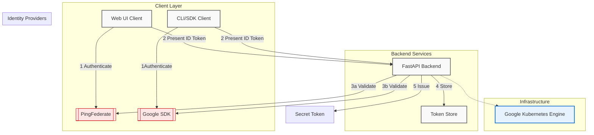
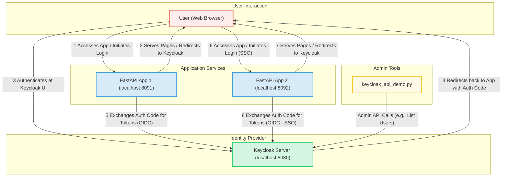
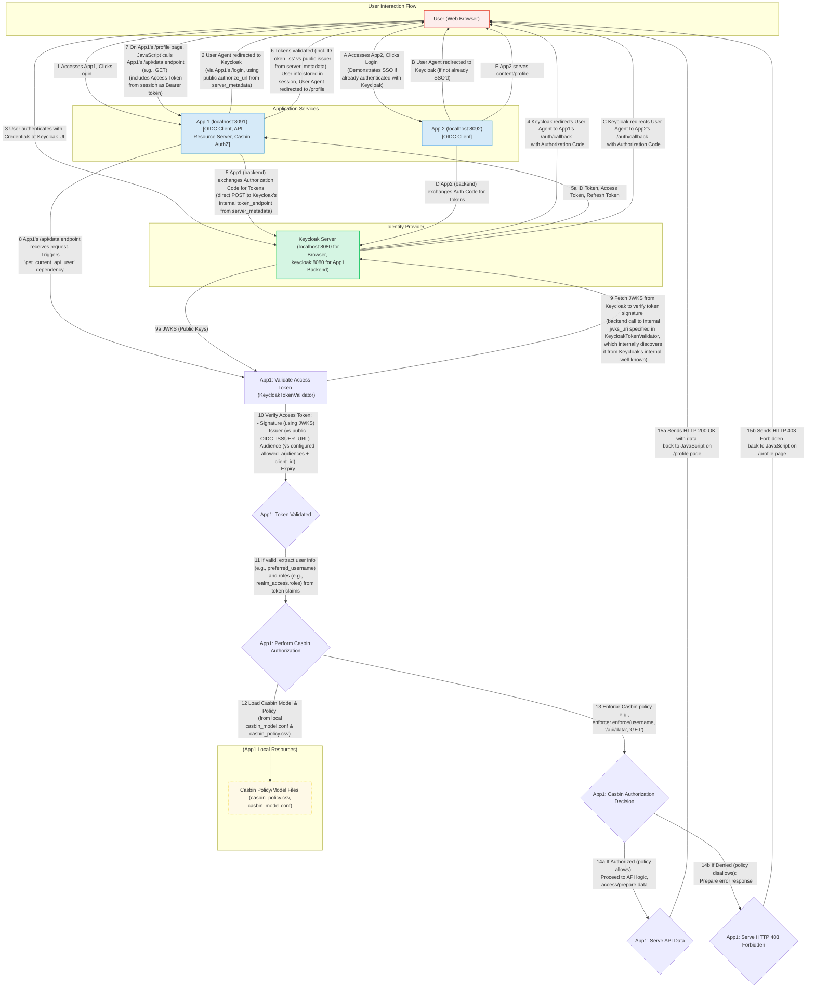
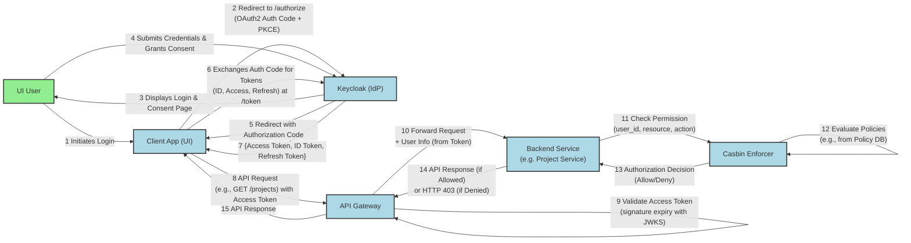
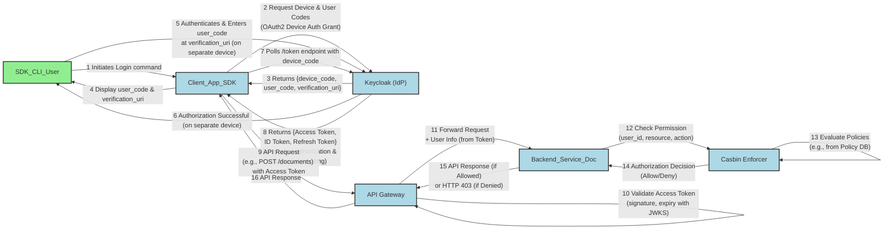
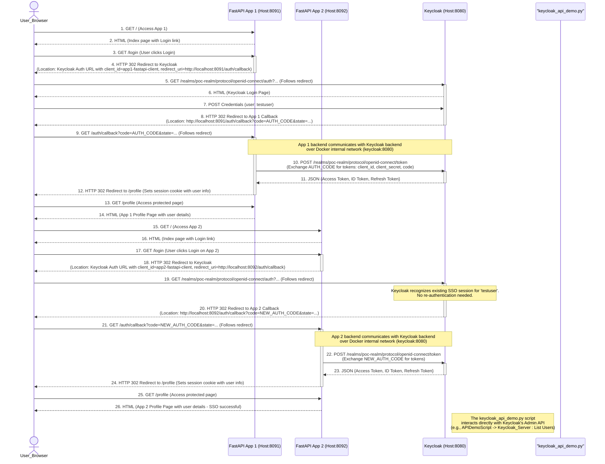

# keycloak-poc

keycloak-fastapi-poc/
├── docker-compose.yml
├── app1/
│   ├── Dockerfile
│   ├── requirements.txt
│   ├── main.py  # FastAPI app
│   └── templates/
│       ├── index.html
│       └── profile.html
├── app2/
│   ├── Dockerfile
│   ├── requirements.txt
│   ├── main.py  # FastAPI app
│   └── templates/
│       ├── index.html
│       └── profile.html
├── keycloak_api_demo/
│   ├── requirements.txt
│   └── demo.py
└── README.md

Existing Auth

**Important:** You will need to replace `YOUR_APP1_FASTAPI_CLIENT_SECRET` and `YOUR_APP2_FASTAPI_CLIENT_SECRET` after you create the clients in Keycloak

**UI User - Authentication (Keycloak) & API Access with Authorization (Casbin)**

**Explanation of Diagram :**

1. **Authentication with Keycloak:**
   * The UI User initiates login via the Client App.
   * The Client App redirects the user to Keycloak, using the OAuth 2.0 Authorization Code Grant with PKCE. ^^
   * The user authenticates with Keycloak and grants consent.
   * Keycloak issues an Authorization Code back to the Client App.
   * The Client App exchanges this code for an Access Token, ID Token, and Refresh Token from Keycloak's token endpoint. ^^
2. **API Access & Authorization with Casbin:**
   * The Client App makes an API request to a Backend Service (via an API Gateway), including the Keycloak-issued Access Token.
   * The API Gateway (or the Backend Service itself) validates the Access Token.
   * The Backend Service extracts user information (e.g., user ID or roles) from the validated token.
   * The Backend Service then calls the Casbin Enforcer, providing the user's identity, the resource they are trying to access, and the action they are attempting. ^^
   * Casbin evaluates this request against its configured policies (which could be stored in a database or file). ^^
   * Based on the policy evaluation, Casbin returns an "Allow" or "Deny" decision.
   * The Backend Service proceeds with the request if allowed or returns an error (e.g., HTTP 403 Forbidden) if denied.

**Explanation of Diagram :**

1. **Authentication with Keycloak (Device Flow):**
   * The SDK/CLI User initiates a login command.
   * The Client App (SDK/CLI) requests device and user codes from Keycloak using the OAuth 2.0 Device Authorization Grant. ^^
   * Keycloak returns these codes, and the Client App displays the `user_code` and `verification_uri` to the user.
   * The user goes to the `verification_uri` on a separate device (e.g., a browser on a smartphone or computer), authenticates with Keycloak, and enters the `user_code`.
   * Meanwhile, the Client App (SDK/CLI) polls Keycloak's token endpoint with the `device_code`.
   * Once the user completes authorization on the separate device, Keycloak provides the Access Token, ID Token, and Refresh Token to the polling Client App. ^^
2. **API Access & Authorization with Casbin:**
   * This part is identical to the UI user flow. The Client App (SDK/CLI) uses the Keycloak-issued Access Token to make API requests.
   * The Backend Service, upon receiving the request (typically after token validation by an API Gateway or itself), uses Casbin to enforce authorization policies based on the user's identity (from the token), the requested resource, and the action
   * 

# Keycloak and FastAPI Authentication PoC

This Proof of Concept demonstrates Keycloak's authentication capabilities with two simple FastAPI web applications, showcasing Single Sign-On (SSO), standard OIDC protocol usage, and a glimpse into Keycloak's admin features and API-driven nature.

Realm and client configuration are now automated via realm import.

## Features Demonstrated

1. **Single Sign-On (SSO):** Login to App1, and you'll be automatically logged into App2.
2. **User Federation (Conceptual):** Users are created in Keycloak. The Admin Console will show where LDAP/AD federation is configured.
3. **Standard Protocols (OIDC):** FastAPI apps use OpenID Connect.
4. **Admin Console & Account Management Console:** Accessible for Keycloak management and user self-service.
5. **API-Driven (Basic Example):** A Python script (`keycloak_api_demo/demo.py`) shows how to interact with Keycloak's Admin API.

## Prerequisites

* Docker Desktop installed and running.
* Git (to clone this repository, or just create the files manually).

## Setup and Running

### 1. Prepare the Environment

* Create the folder structure and files as described.
* Open a terminal in the `keycloak-fastapi-poc` directory.

Aspect `app1``app2`**Role**OIDC Client, API Resource ServerOIDC Client (primarily for SSO demo) **Protected API (self-hosted)** Yes (`/api/data`)No**API Token Validation**Yes (custom `KeycloakTokenValidator`)Not Applicable**Authorization**Yes (Casbin)No**OIDC Scopes** `openid email profile roles``openid email profile`**Key Feature Demonstrated**Protecting custom APIs with Keycloak tokens & fine-grained AuthZ (Casbin)Basic OIDC login and SSO with another app**Complexity**HigherLower**OIDC Config Strategy**Manual `server_metadata` + explicit endpoint URLs (after debugging)Manual `server_metadata` + explicit endpoint URLs (modeled after `app1`)

### 2. Keycloak Configuration (Manual Steps after Keycloak starts)

First, start Keycloak to perform these steps:

### 3. App1 & App2 comparision summary

`app1` has an additional dependency on `casbin` due to its authorization feature.

`app2` has a slightly simpler set of dependencies, lacking `casbin`

| Aspect                      | app1                                                                      | app2                                                                 |
| --------------------------- | ------------------------------------------------------------------------- | -------------------------------------------------------------------- |
| Role                        | OIDC Client, API Resource Server                                          | OIDC Client (primarily for SSO demo)                                 |
| Protected API (self-hosted) | Yes (/api/data)                                                           | No                                                                   |
| API Token Validation        | Yes (custom KeycloakTokenValidator)                                       | Not Applicable                                                       |
| Authorization               | Yes (Casbin)                                                              | No                                                                   |
| OIDC Scopes                 | openid email profile roles                                                | openid email profile                                                 |
| Key Feature Demonstrated    | Protecting custom APIs with Keycloak tokens & fine-grained AuthZ (Casbin) | Basic OIDC login and SSO with another app                            |
| Complexity                  | Higher                                                                    | Lower                                                                |
| OIDC Config Strategy        | Manual server_metadata + explicit endpoint URLs (after debugging)         | Manual server_metadata + explicit endpoint URLs (modeled after app1) |

### 4. Tests

* **Login** :
* Navigate to `http://localhost:8092`
* Click login. You should be redirected to Keycloak.
* Log in with `testuser/password`.
* You should be redirected back to `app2`'s profile page, displaying user information. (This you've confirmed works).
* **Profile Page** :
* Verify that the user information displayed (name, email, etc.) is correct for `testuser`.
* **Logout** :
* From the profile page (or homepage if logged in), click logout.
* You should be redirected to Keycloak for logout, and then Keycloak should redirect you back to `app2`'s homepage (`http://localhost:8092/`).
* Verify that you are indeed logged out of `app2` (e.g., the homepage shows "You are not logged in").
* **Single Sign-On (SSO) with `app1`** :
* **Scenario 1: Login to `app1` first, then `app2`**

  1. Ensure you are fully logged out of both apps and Keycloak (clear browser history/cookies for `localhost` or use an incognito window for a clean test).
  2. Go to `app1` http://localhost:8091/ (`http://localhost:8091/`) and log in with `testuser/password`.
  3. Now, in the  *same browser session* , open a new tab and navigate to `app2` (`http://localhost:8092/`).
  4. When you click "Login" on `app2`, you should ideally be logged in *without* needing to re-enter credentials at Keycloak, or Keycloak might briefly appear and redirect you back quickly. You should land on `app2`'s profile page. This demonstrates SSO.
* **Scenario 2: Login to `app2` first, then `app1`**

  1. Ensure clean browser state.
  2. Go to `app2` (`http://localhost:8092/`) and log in.
  3. In the same browser session, navigate to `app1` (`http://localhost:8091/`).
  4. Click "Login" on `app1`. You should experience SSO and be logged into `app1`'s profile page.
* **Single Logout (SLO) - (Basic Check)** :
* Log in to both `app1` and `app2` in the same browser.
* Log out from `app1`.
* Now, go to `app2`. Are you still logged into `app2`, or are you logged out?
* Then try logging out from `app2` and check `app1`.
* *Note* : True OIDC front-channel or back-channel logout for full SLO across multiple applications can be complex to configure perfectly and might require more settings in Keycloak clients (like Front-channel logout URLs) and specific handling in the apps. Your current setup does a standard OIDC logout which logs the user out of Keycloak and the current app. The SSO session at Keycloak being terminated should mean other apps will require re-authentication.

#### Authorization Test

testuser:

In Keycloak, under your poc-realm, go to "Realm Roles".

Create a new role named data_readers_role.
Go to "Users", select testuser.
Go to the "Role mapping" tab for testuser.
Assign the data_readers_role to testuser from "Available Roles" to "Assigned Roles".

"Admin" User (e.g., create adminuser):
In Keycloak, create a new user, for example:
Username: adminuser
Set a password (e.g., password).
Ensure "Email verified" is on if needed by your setup.
Create a realm role named admin_role (if it doesn't exist).
Assign the admin_role to your adminuser.

"Regular" User (e.g., create nouser with no specific API roles):
In Keycloak, create another user:
Username: nouser
Set a password (e.g., password).
Do not assign admin_role or data_readers_role to this user.

Scenario 1: testuser
testuser has direct GET permission and GET permission via data_readers_role.testuser should NOT have POST permission.
Get Access Token for testuser -- login to app1 .. inspect get value of fullaccesstoken

Test GET /api/data (Expected: ALLOWED):

ACCESS_TOKEN_TESTUSER="eyJhbGciOiJSUzI1NiIsInR5cCIgOiA"
$ curl -X GET http://localhost:8091/api/data -H "Authorization: Bearer $ACCESS_TOKEN_TESTUSER"
[{"id":"item1","name":"Sample Item Alpha","value":"This is a test item."},{"id":"item2","name":"Sample Item Beta","value":"Another piece of data."}]

curl -X POST http://localhost:8091/api/data 
    -H "Authorization: Bearer $ACCESS_TOKEN_TESTUSER"
    -H "Content-Type: application/json"
    -d '{"id": "item_test", "name": "Test Item by testuser", "value": "some value"}'

$ curl -X POST http://localhost:8091/api/data \

> -H "Authorization: Bearer $ACCESS_TOKEN_TESTUSER" 
> -H "Content-Type: application/json" 
> -d '{"id": "item_test", "name": "Test Item by testuser", "value": "some value"}'
> {"detail":"Not authorized to POST data"}

Scenario 2: adminuser (with admin_role)
adminuser (via admin_role) should have GET and POST permission.
Get Access Token for adminuser.

Test GET /api/data (Expected: ALLOWED):

**GET**

ACCESS_TOKEN_ADMINUSER="eyJhbGciOiJSUzI1NiIsInR5cg"
curl -X GET http://localhost:8091/api/data -H "Authorization: Bearer $ACCESS_TOKEN_ADMINUSER"

**POST**

curl -X POST http://localhost:8091/api/data 
    -H "Authorization: Bearer $ACCESS_TOKEN_ADMINUSER"
    -H "Content-Type: application/json"
    -d '{"id": "item_admin", "name": "Admin Item", "value": "posted by admin"}'

result
{"id":"item_admin","name":"Admin Item","value":"posted by admin"}

Scenario 3: nouser (no specific relevant roles)
nouser should have NEITHER GET nor POST permission.

**GET**

ACCESS_TOKEN_NOUSER="eyJhbGciOiJSUzI1NiIsInR5cCIgOiAiSldUIiwia2lkIiA6ICItYkR2bGF"
curl -X GET http://localhost:8091/api/data -H "Authorization: Bearer $ACCESS_TOKEN_NOUSER"

{"detail":"Not authorized to GET data"}

**POST**

curl -X POST http://localhost:8091/api/data 
    -H "Authorization: Bearer $ACCESS_TOKEN_NOUSER"
    -H "Content-Type: application/json"
    -d '{"id": "item_nouser", "name": "NoUser Item", "value": "attempted by nouser"}'

{"detail":"Not authorized to POST data"}
